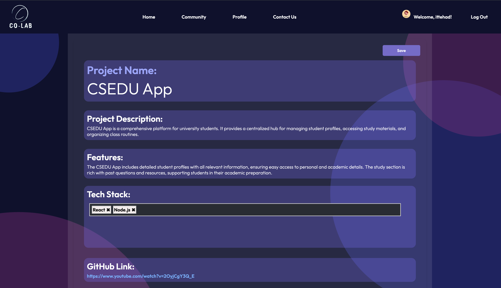

```markdown
# CoLab

CoLab is a collaborative platform where users can share their projects, engage with communities, and contribute to blogs. This project includes a frontend built with React and a backend built with FastAPI.

## Table of Contents

- [Features](#features)
- [Technologies Used](#technologies-used)
- [Getting Started](#getting-started)
- [Usage](#usage)
- [API Endpoints](#api-endpoints)
- [Screenshots](#screenshots)
- [Contributing](#contributing)
- [License](#license)

## Features

- User profile creation and management
- Project and blog sharing
- Community engagement
- Detailed project descriptions and features
- Search and filter options
- Interactive blogs

## Technologies Used

**Frontend:**
- React
- CSS Modules

**Backend:**
- FastAPI
- Python

## Getting Started

### Prerequisites

- Node.js
- Python 3.7+

**Clone the repository**
```bash
git clone https://github.com/yourusername/colab.git
```

### Running the Application

**Frontend:**

```bash
cd FRONTEND
npm start
```

**Backend:**

```bash
cd BACKEND
uvicorn main:app --reload
```

## Usage

- Navigate to `http://localhost:3000` to access the frontend.
- The backend API will be running at `http://localhost:8000`.

## API Endpoints

Here are some example endpoints:

- `GET /api/projects` - Retrieve all projects
- `POST /api/projects` - Create a new project
- `GET /api/projects/{id}` - Retrieve a specific project by ID
- `PUT /api/projects/{id}` - Update a project by ID
- `DELETE /api/projects/{id}` - Delete a project by ID
- `GET /api/blogs` - Retrieve all blogs
- `POST /api/blogs` - Create a new blog
- `GET /api/blogs/{id}` - Retrieve a specific blog by ID
- `PUT /api/blogs/{id}` - Update a blog by ID
- `DELETE /api/blogs/{id}` - Delete a blog by ID

## Screenshots





## Contributing

Contributions are welcome! Please read the [contributing guidelines](CONTRIBUTING.md) first.

## License

This project is licensed under the MIT License. See the [LICENSE](LICENSE.md) file for details.
```
